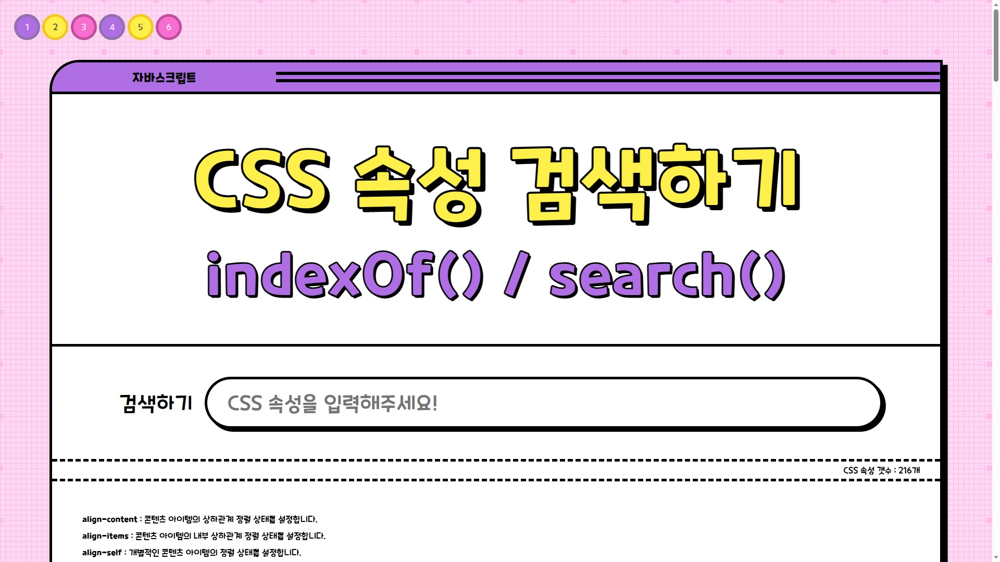

# JS-mouse

자바스크립트로 작성한 서치 이펙트 입니다. 

******

📓 사용 스택 및 함수(메서드)
---

➡️ HTML: 웹 페이지의 구조를 정의하는 데 사용됩니다.  
➡️ CSS : 웹 페이지와 애플리케이션의 시각적 디자인과 레이아웃을 제어하여 사용자 경험을 향상시키는 스타일링 언어입니다   
➡️ javascript : 
+e.target.value: 이벤트 객체를 통해 사용자가 입력한 값을 가져옵니다.
+addEventListener(): 이벤트를 등록하여 해당 이벤트가 발생했을 때 특정 동작을 실행하는 메서드입니다. 
+classList.add(): HTML 요소의 클래스 목록에 새로운 클래스를 추가하는 메서드입니다. 
+classList.remove(): HTML 요소의 클래스 목록에서 클래스를 제거하는 메서드입니다. 
+dataset: HTML 요소의 data-* 속성들을 가져오거나 설정하는 속성입니다. 

# 프로젝트 목적

---

📕 addEventListener 이해  
📕 classList 이해  
📕 dataset 이해  
📕 e.target 이해  

